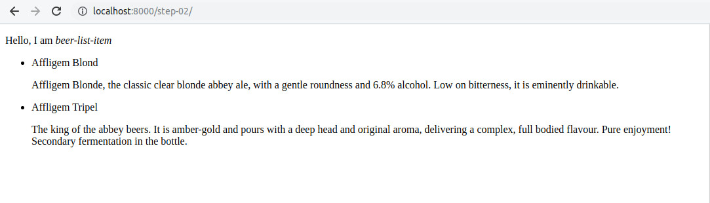

#  LitElement Beers - LitElement tutorial - Step 02

In this step we are going to use our first LitElement, a very simple custom `beer-list-item`.
By using it you will see how easily you can add LitElement widgets to your normal web applications.


## Dependencies ##

In this step we are adding two dependencies: 

- [LitElement](https://lit-element.polymer-project.org/), a simple base class for creating fast, lightweight web components
- [@pika/web](https://www.pikapkg.com/blog/pika-web-a-future-without-webpack), to make npm packages run natively in the browser

Let's begin  by creating a new `package.json`: 

```json
{
  "name": "lit-element-beers",
  "version": "1.0.0",
  "description": "LitElement Beers - A LitElement tutorial",
  "main": "index.js"
}
```

And add the dependencies using `npm`:

```bash
npm install lit-element
npm install --save-dev @pika/web
```

You should get something like:

<pre style="background-color: #300A24;"><code>$ npm install lit-element
[..................] / fetchMetadata: sill removeObsoleteDep removing lit-html@1.0.0 from the tree as its been replaced by a newer version or is no longer required
+ lit-element@2.1.0
added 2 packages from 1 contributor and audited 2 packages in 1.144s
found 0 vulnerabilities

$ npm install --save-dev @pika/web
+ @pika/web@0.4.2
added 184 packages from 169 contributors and audited 2814 packages in 8.387s
found 0 vulnerabilities

</code></pre>

## Use *@pika/web* to make the elements ready for the browser

In a production application, you should use tools like [webpack](https://webpack.js.org/) or [Rollup](https://rollupjs.org/). But in a development setting, using those tools make things considerably more complicated. 
We are using an alternative, [@pika/web](https://github.com/pikapkg/web), to run npm dependencies directly in the browser. No Rollup, Webpack or import maps required. 

*@pika/web* installs npm packages as single `.js` files to a new web_modules/ directory. If your dependency exports an ES "module" entrypoint in its package.json manifest, it is supported. Even if it internally depends on other npm packages (even legacy `Common.js` packages) *@pika/web* should be able to handle it.

Now run *@pika/web* in your project:

```
$ npx @pika/web
```

It will create a browser ready version of LitElement class file on `web_modules` folder, `web_modules/lit-element.js`, that can be imported from anywhere in your code.


## The custom element

We are adding a custom `beer-list-item` LitElement element that will be stored in the `elements` folder.

LitElement allows us to quickly define and declare custom elements. Custom elements provide a component model for the web. The custom elements specification provides:

- A mechanism for associating a class with a custom element name.
- A set of lifecycle callbacks invoked when an instance of the custom element changes state (for example, added or removed from the document).
- A callback invoked whenever one of a specified set of attributes changes on the instance.

Put together, these features let you build an element with its own public API that reacts to state changes. LitElement provides a set of features on top of the basic custom element specification.


## The `BeerListItem` custom element

By specification, the custom element's name must start with a lower-case ASCII letter and must contain a dash (`-`).

You're going to define your first element, `beer-list-item`. Let's begin by creating a `beer-list-item.js` file in the `elements` folder: 

```js
/**
 * TODO: Import the LitElement base class and html helper function.
 */
import { } from ''; 

/**
 * TODO: Create a class for your element that extends the LitElement
 * base class.
 */
class BeerListItem { }    

/**
 * TODO: Register the new element with the browser.
 */
customElements.define();
```

Now we are going to complete the element definition:

1. Import the `LitElement` base class and `html` helper function.

    In `beer-list-item.js`, replace the existing import statement with the following code:

    ```js
    import { LitElement, html } from '../web_modules/lit-element.js';
    ```

1. Create a class for your element that extends the `LitElement` base class.

    In `beer-list-item.js`, replace the existing class definition with the following code:

    ```js
    class BeerListItem extends LitElement {
      render() {
        return html`
          <p>Hello world! From beer-list-item</p>
        `;
      }
    }
    ```

    The render function defines your component’s template. You must implement render for every LitElement component.

1. Register the new element with the browser.

    In `beer-list-item.js`, replace the existing call to `customElements.define()` with the following code:

    ```js
    customElements.define('beer-list-item', BeerListItem);
    ```

Here’s the completed code for the element:

`beer-list-item.js`
```js
import { LitElement, html } from '../web_modules/lit-element.js';

class BeerListItem extends LitElement {
  render() {
    return html`
      <p>Hello world! From beer-list-item</p>
    `;
  }
}

customElements.define('beer-list-item', BeerListItem);
```

The element should be working now. Test it by adding it to `index.html` file and reloading the file in the browser:

1. Load the element definition with:

    ```html
    <script type="module" src="./elements/beer-list-item.js"></script>
    ```

1. And then add it to the page. LitElement components are added to a page with simple HTML tags, like this:

    ```html
    <beer-list-item></beer-list-item>
    ```




A LitElement usually has properties, instance variables defining its state. Properties are declared in a `properties` static getter, that return the observable properties that cause the 
element to update.

In our case we need two properties, `name` and `description`. Let's add them: 

1.  Declare a property.

    ```js
    static get properties() {
      return {     
        name: {
          type: String,
        },
        description: {
          type: String,
        }
      };
    }
    ```

1.  Initialize the property.

    A good place to initialize property values is in your element constructor:

    ```js
    constructor() {
      super();
      this.name = 'A beer';
      this.description = 'Description of the beer';
    }
    ```
    The first line of code in the constructor (`super();`) calls the parent class constructor.


1.  Add the property to your template.

    You can add properties to your LitElement templates with JavaScript expressions.

    In `beer-list-item`, replace the existing render function with the following code:

    ```js
    render() {
      return html`
        <div class="beer">
          <h2>${this.name}</h2>
          <p>${this.description}</p>
        </div>
      `;
    }
    ```

1.  Add some style to the `render()` method to make the `beer-list-item` prettier:

    ```js
    render() {
      return html`
        <style>
          .beer {
            margin: 10px;
            padding: 10px;
            border: solid 1px black;
            border-radius: 10px;
            min-height: 50px;
          }
        </style>
        <div class="beer">
          <h2>${this.name}</h2>
          <p>${this.description}</p>
        </div>
      `;
    }
    ```

You will get (lots of) more details on custom element definition on further steps, by now this should be enough.

## Use `beer-list-item` to list your beers

Rplace the `<ul>` and the `<li>` items that you created in [step-01](../step-01/) with two `beer-list-item` elements, one for each beer:

```html
<beer-list-item
  name="Affligem Blond"
  description="Affligem Blonde, the classic clear blonde abbey ale, with a gentle roundness and 6.8%..."
></beer-list-item>

<beer-list-item
  name="Affligem Tripel"
  description="The king of the abbey beers. It is amber-gold and pours with a deep head and original..."
></beer-list-item>
```


## Local DOM and data binding 

Data binding binds a property or sub-property of a custom element (the host element) to a property or attribute of an element in its local DOM (the child or target element).

The standard way to create the binding in LitElement is using the `render()` method.
In this template literal we generate an HTML entity using a JS template literal, where we can call for the objects properties using the standard variable interpolation syntax (`${this.property_name}`).

The `render()` method is called after any property change is detected.

To bind to a child property, specify the attribute name that corresponds to the property, with an annotation as the attribute value:

```html
<beer-list-item
  name="Affligem Tripel"
  description="The king of the abbey beers. It is amber-gold and pours with a deep head and original..."
></beer-list-item>
```

Here we are defining an instance of `beer-list-item`  component binding the component `name` property to `"Affligem Tripel"` and the `description` to `"The king of the abbey beers. It is amber-gold and pours with a deep head and original..."`.

For more information about rendering in LitElement, see the [LitElement documentation](https://lit-element.polymer-project.org/guide/templates)


## Declared properties ##

Any property that’s part of your element’s public API should be declared in the object returned by the `properties` getter  of the custom element.

In this `properties` object you associated the property name to a string defining the property type or to an object describing more details of the property.

```js
  static get properties() {
    return {
      name: {
        type: String,
      },
      description: {
        type: String,
      }
    }
  }
```

For more information about properties, see the [LitElement documentation](https://lit-element.polymer-project.org/guide/properties)


## Additional experiments

Try modifying the element to show the beer name in red.

You will see that you need to do it inside the `style` block of the `template` getter for the element. Following the encapsulation principle, global CSS rules don't pass the element frontier.

## Summary

You have added a LitElement custom web component to an otherwise static app. Now go to [step-03](../step-03/) to see how to create another element to automatically generate the beer list.
