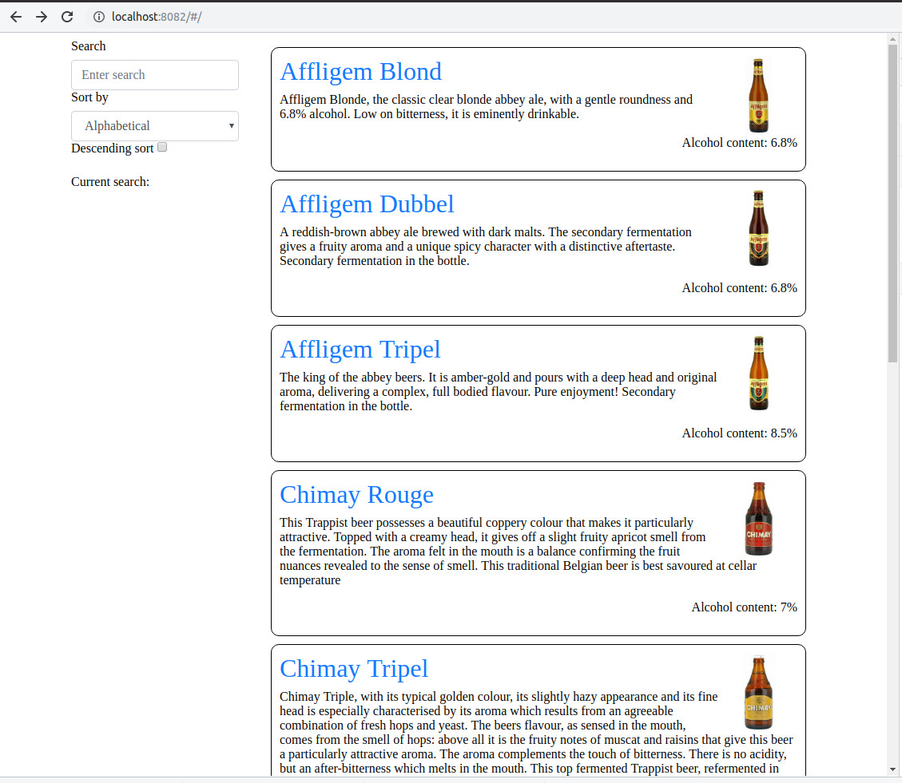
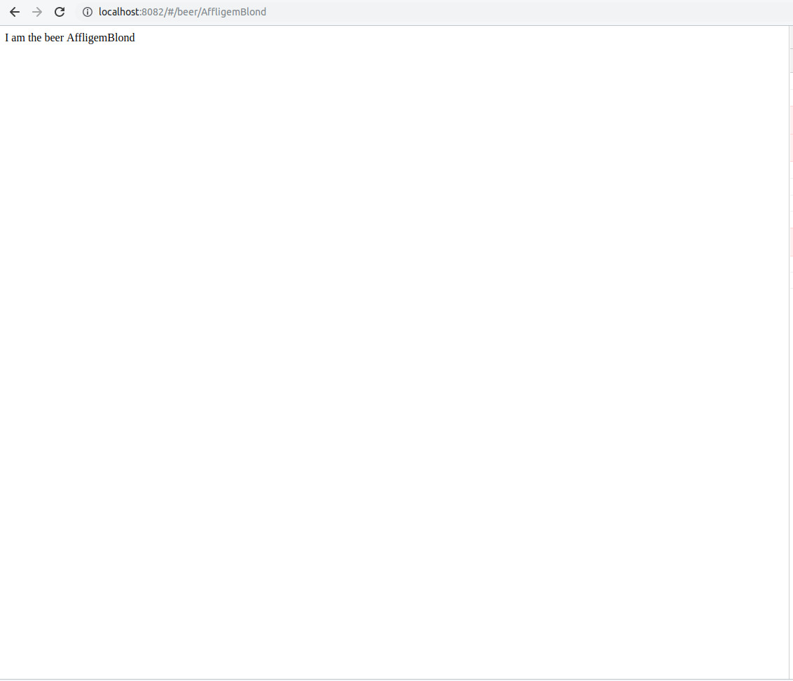

#  LitElement Beers - LitElement tutorial - Step 07


What if we wanted to show more details about a beer when we click on it? We can imagine opening another panel with the detailed information.

In Angular, Vue or React we would get this behavior by using a router, and defining the routing conditions in the global application definition. How can we do it with web components?

Well, in the same way, we can web-component router, like [`@vaadin/router`](https://vaadin.com/router). We are going to use it to do the routing side of our app without having to change things in our elements. We aren't using directly `@vaadin/router`, but a fork of it, [`granite-vaadin-router`]() that supports hash (URL fragment) navigation, easier to implement in this tutorial.

## Creating a `beer-main` element

The first thing we are going to do is to create a main element that will do the routing and choose either to show the beer list or the detail on a beer.

Let's create `beer-main`:

```js
import { LitElement, html } from '../web_modules/lit-element.js';

import bootstrapStyle from '../web_modules/@granite-elements/granite-lit-bootstrap.js';

class BeerMain extends LitElement {

  static get properties() {
    return { 
    };
  }

  static get styles() {
    return bootstrapStyle;
  }
  
  render() {
    return html`
    `;
  }
}

customElements.define('beer-main', BeerMain);
```

Now we are going to add `granite-vaadin-router` to it. 

First of all, me need to install `granite-vaadin-router` using `npm`:

```shell
npm i @granite-elements/granite-vaadin-router
```

And run `@pika/web` to generate the modules for the browser:

```
npx @pika/web
```

Let's import `granite-vaadin-router` in `beer-main`:


Then we need to import `app-route` and its companion `app-location` into `beer-main`:

```js
import { HashRouter } from '../web_modules/@granite-elements/granite-vaadin-router.js';
```


The router config maps URL paths to Web Components. Vaadin Router goes through the routes until it finds the first match, creates an instance of the route component, and inserts it into the router outlet(replacing any pre-existing outlet).

We define an anchor for the router, the outlet, in the element template:

```js
render() {
  return html`
    <div id='outlet'>
    </div>
  `;
}
```

And in the [lifecycle method](https://lit-element.polymer-project.org/guide/lifecycle) [`firstUpdated()`](https://lit-element.polymer-project.org/guide/lifecycle#firstupdated) (called after the element’s DOM has been updated the first time), we initialize the router and define the routes. In our case, we want a route to see the beer list and a route with a parameter to show the details of a beer.

```js
firstUpdated() {
  const outlet = document.shadowRoot.getElementById('outlet');
  const router = new HashRouter(outlet);
  router.setRoutes([
    {path: '',     component: 'beer-list'},
    {path: '/',     component: 'beer-list'},
    {path: '/beers',  component: 'beer-list'},
    {path: '/beer/:id', component: 'beer-details'},
  ]);
}
```

The route for the beer list will point to `beer-list`, the route for the beer details will point to a new element we are going to write next.

Don't forget to import `beer-list` into `beer-main`:

```js
import './beer-list.js';
```

Now in the main `index.html` file replace `beer-list` by `beer-main`:

```html
<!doctype html>
<html lang="en">
<head>
  <meta charset="utf-8">
  <title>LitElement Beer Gallery</title>
  <script type="module" src="./elements/beer-main.js"></script>
</head>

<body>
  <beer-main></beer-main>
</body>
</html>
```


## Showing current choice

To keep the learning curve gentle, in the current step we are only showing messages informing use of what beer (if any) is currently selected. To do it, we are doing a quick and dirty first version of `beer-details` element, simply showing the ID of the chosen beer.

Route parameters are bound to the `location.params` property of the route Web Component (the `route` property is set on the route component by Vaadin Router).

`beer-details.js`
```js
import { LitElement, html } from '../web_modules/lit-element.js';

import bootstrapStyle from '../web_modules/@granite-elements/granite-lit-bootstrap.js';

class BeerMain extends LitElement {

  static get properties() {
    return { 
      location: {
        type: Object,
      }
    };
  }

  static get styles() {
    return bootstrapStyle;
  }

  render() {
    return html`
      <div id='details'>
        I am the beer ${this.location.params.id}
      </div>
    `;
  }
}

customElements.define('beer-details', BeerDetails);
```

And we import it in `beer-main`:

```js
import './beer-details.js';
```


## Hyperlinking the beers

In order to get more details on a beer when we click on its name, we need to modify `beer-list-item` template, to put the beer name inside a `<a>` tag that will send us to the route corresponding to that beer.

```js
  render() {
    return html`
      <style>
        ...
      </style>
      <div id="${this.id}" class="beer clearfix">
        
        <a href="#/beer/${this.id}">
          <h2 class="el-name">${this.name}</h2>
        </a>        
        <p class="el-description">${this.description}</p>
        <p class="float-right el-alcohol">Alcohol content: ${this.alcohol}%</p>
      </div>
    `;
  }
```

We haven't any default routing. What if we want to detect an initial unsupported route and redirect the page to the main beer list? We can do it and simplify global routing:

```js
  firstUpdated() {
    const outlet = this.shadowRoot.querySelector('#outlet');
    const router = new HashRouter(outlet,);
    router.setRoutes([
      {path: '/beers',  component: 'beer-list'},
      {path: '/beer/:id', component: 'beer-details'},
      {path: '(.*)', component: 'beer-list'}
    ]);
  }
```

## Testing

And now you can go to you app, see the hyper-linked beer list, click on one of them and see the details!



